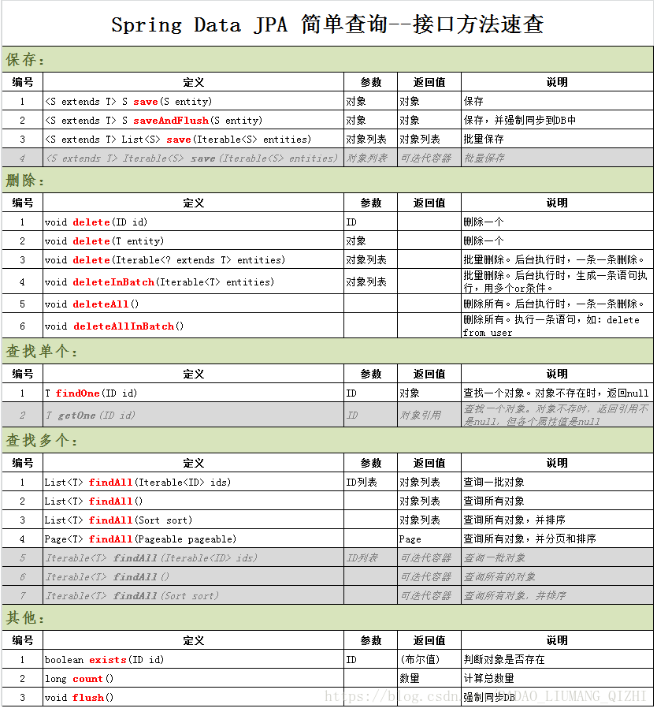

# FAQ收录

## 一 spring security

## 二 spring boot

## 三 问题归档##

	org.springframework.web.util.NestedServletException: Request processing failed; nested exception is org.thymeleaf.exceptions.TemplateInputException: Template mode "html" has not been configured
	at org.springframework.web.servlet.FrameworkServlet.processRequest(FrameworkServlet.java:982) ~[spring-webmvc-4.3.18.RELEASE.jar:4.3.18.RELEASE]
	at org.springframework.web.servlet.FrameworkServlet.doGet(FrameworkServlet.java:861) ~[spring-webmvc-4.3.18.RELEASE.jar:4.3.18.RELEASE]
	at javax.servlet.http.HttpServlet.service(HttpServlet.java:635) ~[tomcat-embed-core-8.5.31.jar:8.5.31]
	at org.springframework.web.servlet.FrameworkServlet.service(FrameworkServlet.java:846) ~[spring-webmvc-4.3.18.RELEASE.jar:4.3.18.RELEASE]
	at javax.servlet.http.HttpServlet.service(HttpServlet.java:742) ~[tomcat-embed-core-8.5.31.jar:8.5.31]
	at org.apache.catalina.core.ApplicationFilterChain.internalDoFilter(ApplicationFilterChain.java:231) ~[tomcat-embed-core-8.5.31.jar:8.5.31]
	at org.apache.catalina.core.ApplicationFilterChain.doFilter(ApplicationFilterChain.java:166) ~[tomcat-embed-core-8.5.31.jar:8.5.31]
	at org.apache.catalina.core.ApplicationDispatcher.invoke(ApplicationDispatcher.java:728) ~[tomcat-embed-core-8.5.31.jar:8.5.31]
	at org.apache.catalina.core.ApplicationDispatcher.processRequest(ApplicationDispatcher.java:472) ~[tomcat-embed-core-8.5.31.jar:8.5.31]
	at org.apache.catalina.core.ApplicationDispatcher.doForward(ApplicationDispatcher.java:395) ~[tomcat-embed-core-8.5.31.jar:8.5.31]
	at org.apache.catalina.core.ApplicationDispatcher.forward(ApplicationDispatcher.java:316) ~[tomcat-embed-core-8.5.31.jar:8.5.31]
	at org.apache.catalina.core.StandardHostValve.custom(StandardHostValve.java:395) [tomcat-embed-core-8.5.31.jar:8.5.31]
	at org.apache.catalina.core.StandardHostValve.status(StandardHostValve.java:254) [tomcat-embed-core-8.5.31.jar:8.5.31]
	at org.apache.catalina.core.StandardHostValve.throwable(StandardHostValve.java:349) [tomcat-embed-core-8.5.31.jar:8.5.31]
	at org.apache.catalina.core.StandardHostValve.invoke(StandardHostValve.java:175) [tomcat-embed-core-8.5.31.jar:8.5.31]
	at org.apache.catalina.valves.ErrorReportValve.invoke(ErrorReportValve.java:81) [tomcat-embed-core-8.5.31.jar:8.5.31]
	at org.apache.catalina.core.StandardEngineValve.invoke(StandardEngineValve.java:87) [tomcat-embed-core-8.5.31.jar:8.5.31]
	at org.apache.catalina.connector.CoyoteAdapter.service(CoyoteAdapter.java:342) [tomcat-embed-core-8.5.31.jar:8.5.31]
	at org.apache.coyote.http11.Http11Processor.service(Http11Processor.java:803) [tomcat-embed-core-8.5.31.jar:8.5.31]
	at org.apache.coyote.AbstractProcessorLight.process(AbstractProcessorLight.java:66) [tomcat-embed-core-8.5.31.jar:8.5.31]
	at org.apache.coyote.AbstractProtocol$ConnectionHandler.process(AbstractProtocol.java:790) [tomcat-embed-core-8.5.31.jar:8.5.31]
	at org.apache.tomcat.util.net.NioEndpoint$SocketProcessor.doRun(NioEndpoint.java:1468) [tomcat-embed-core-8.5.31.jar:8.5.31]
	at org.apache.tomcat.util.net.SocketProcessorBase.run(SocketProcessorBase.java:49) [tomcat-embed-core-8.5.31.jar:8.5.31]
	at java.util.concurrent.ThreadPoolExecutor.runWorker(ThreadPoolExecutor.java:1142) [na:1.8.0_131]
	at java.util.concurrent.ThreadPoolExecutor$Worker.run(ThreadPoolExecutor.java:617) [na:1.8.0_131]
	at org.apache.tomcat.util.threads.TaskThread$WrappingRunnable.run(TaskThread.java:61) [tomcat-embed-core-8.5.31.jar:8.5.31]
	at java.lang.Thread.run(Thread.java:748) [na:1.8.0_131]
Caused by: org.thymeleaf.exceptions.TemplateInputException: Template mode "html" has not been configured
	at org.thymeleaf.TemplateRepository.getTemplate(TemplateRepository.java:256) ~[thymeleaf-2.1.6.RELEASE.jar:2.1.6.RELEASE]
	at org.thymeleaf.TemplateEngine.process(TemplateEngine.java:1104) ~[thymeleaf-2.1.6.RELEASE.jar:2.1.6.RELEASE]
	at org.thymeleaf.TemplateEngine.process(TemplateEngine.java:1060) ~[thymeleaf-2.1.6.RELEASE.jar:2.1.6.RELEASE]
	at org.thymeleaf.TemplateEngine.process(TemplateEngine.java:1011) ~[thymeleaf-2.1.6.RELEASE.jar:2.1.6.RELEASE]
	at org.thymeleaf.spring4.view.ThymeleafView.renderFragment(ThymeleafView.java:335) ~[thymeleaf-spring4-2.1.6.RELEASE.jar:2.1.6.RELEASE]
	at org.thymeleaf.spring4.view.ThymeleafView.render(ThymeleafView.java:190) ~[thymeleaf-spring4-2.1.6.RELEASE.jar:2.1.6.RELEASE]
	at org.springframework.web.servlet.DispatcherServlet.render(DispatcherServlet.java:1286) ~[spring-webmvc-4.3.18.RELEASE.jar:4.3.18.RELEASE]
	at org.springframework.web.servlet.DispatcherServlet.processDispatchResult(DispatcherServlet.java:1041) ~[spring-webmvc-4.3.18.RELEASE.jar:4.3.18.RELEASE]
	at org.springframework.web.servlet.DispatcherServlet.doDispatch(DispatcherServlet.java:984) ~[spring-webmvc-4.3.18.RELEASE.jar:4.3.18.RELEASE]
	at org.springframework.web.servlet.DispatcherServlet.doService(DispatcherServlet.java:901) ~[spring-webmvc-4.3.18.RELEASE.jar:4.3.18.RELEASE]
	at org.springframework.web.servlet.FrameworkServlet.processRequest(FrameworkServlet.java:970) ~[spring-webmvc-4.3.18.RELEASE.jar:4.3.18.RELEASE]
	... 26 common frames omittedjava

